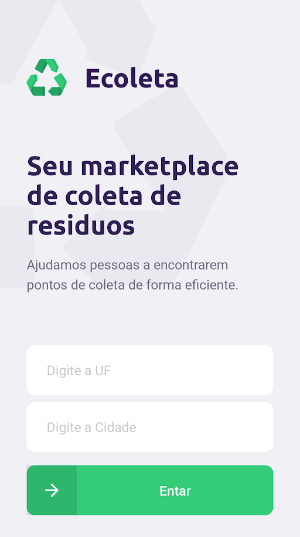
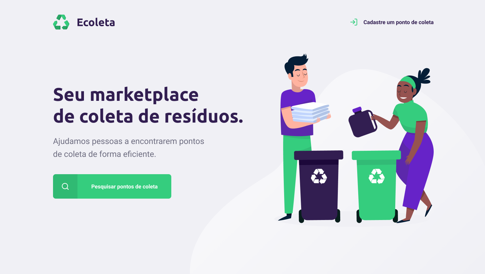

<h1 align="center">
  
</h1>

  <a href="#about">About</a>&nbsp;&nbsp;&nbsp;
  <a href="#project">Project</a>&nbsp;&nbsp;&nbsp;
  <a href="#Technologies">Technologies</a>&nbsp;&nbsp;&nbsp;

##  About
:recycle: **Ecoleta** to help people find collection points for recycling efficiently.

##  Project
[Layout in Figma](https://www.figma.com/file/1SxgOMojOB2zYT0Mdk28lB/Ecoleta)
 

  
  

##  Technologies
Technologies used in the project.

- [NodeJS](https://nodejs.org/)
- [TypeScript](https://www.typescriptlang.org/)
- [ReactJS](https://reactjs.org/)
- [React Native](https://reactnative.dev/)
- [Expo](https://expo.io/)

## 

<h4 align="center">
    Feito com :heart: by <a href="https://www.linkedin.com/in/joseadilson/" target="_blank">José Adilson</a>
</h4>
